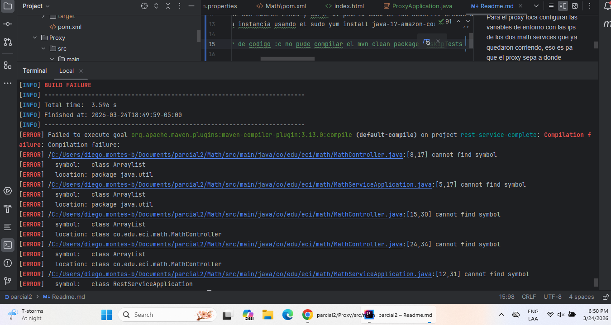
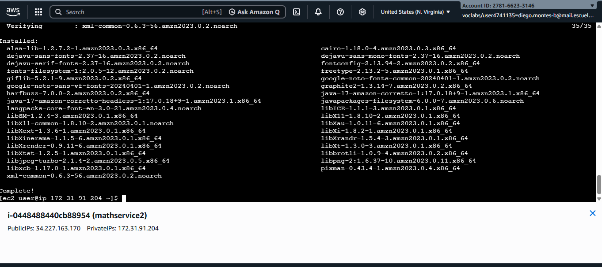
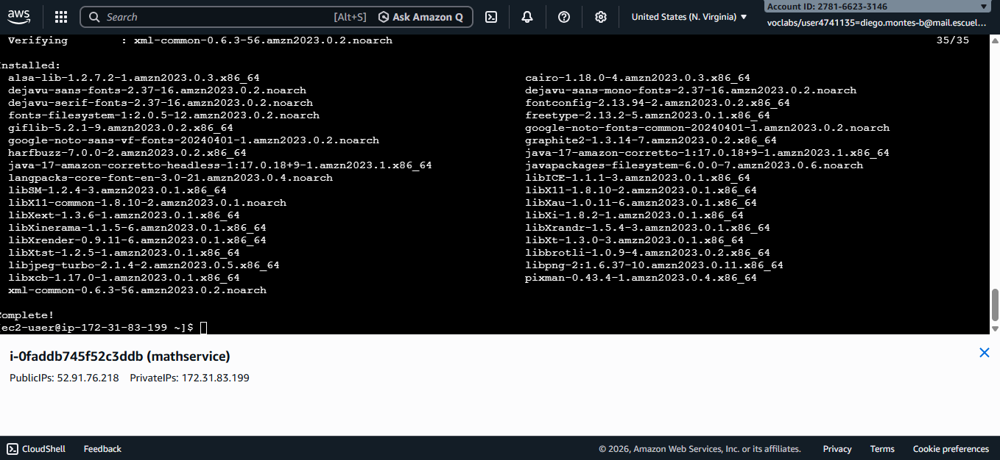
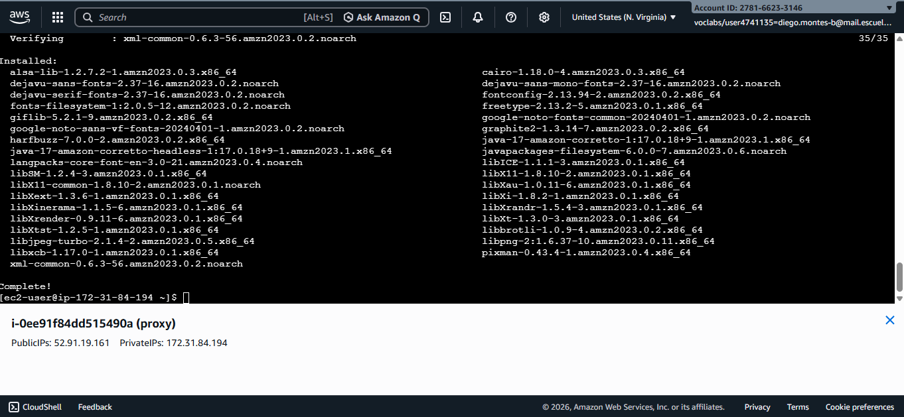

# Parcial 2 - Microservicios Activo-Pasivo 

## Descripcion del parcial

Aplicacion web que va a implementar un algoritmo activo pasivo basado en Fibonacci con ventana donde el sistema tiene tres partes principales: 
* **Math Service**: Servicio REST que va a computar las funciones numericas y esta desplegado en dos instancias de EC2. 
* **Proxy Service**: Es el que recibe las solicitudes del cliente y se las manda al servicio activo, si ese se cae se las manda al pasivo. 
* **Cliente Web**: Es un formulario en HTML y JS que va a llamar al proxy de forma asincrona. 

## Como correrlo en EC2 
Primero toca crear 3 instancias EC2 con Amazon Linux y abrir el puerto 8080 en los security groups de las tres. 
Despues toca instalar java en cada instancia usando el sudo yum install java-17-amazon-corretto -y, copiar el jar del math service a las dos instancias que vamos a usar para ese servicio y correrlo en cada una. 

> No pude obtener el jar por error de codigo :c no pude compilar el mvn clean package -DskipTests 

Para el proxy toca configurar las variables de entorno con las ips de los dos math services que ya quedaron corriendo, eso es pa que el proxy sepa a donde mandar las solicitudes sin tener que tocar el codigo. Despues se copia el jar del proxy a la tercera instancia y se corre.
Para probarlo toca abrir el browser con la ip de la instancia del proxy en el puerto 8080. 

## Variables de entorno 
El proxy usa dos variables de entorno pa saber a donde va a mandar las solicitudes: 
* **MATH_SERVICE_1**: que es la ip y puerto del servicio activo 
* **MATH_SERVICE_2**: que es la ip y puerto del servicio pasivo 

## Tecnologias usadas 
* Java 17 
* Spring Boot 3.3.0 
* Maven 
* HTML5 y JavaScript 
* AWS EC2 
* GitHub
